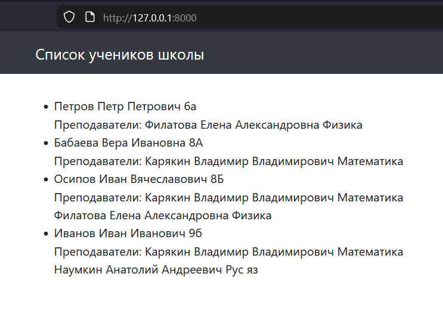

# Django ORM — Миграции

Выполнено задание по изменению связи моделей в Django.

### Что сделано

* Связь между моделями **Student** и **Teacher** изменена с `ForeignKey` на `ManyToManyField`.
* Добавлен параметр `related_name='students'`.
* Обновлён шаблон списка учеников для отображения нескольких учителей.
* В `views.py` добавлено `prefetch_related` для оптимизации SQL-запросов.
* Выполнены миграции базы данных.

### Результат

